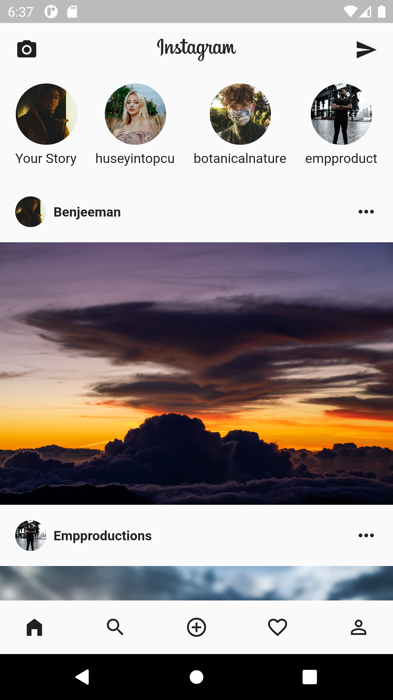

# Flutter Beginner Insta

Create the Instagram Home Screen in Flutter using Level 1 Widgets.

## Resources

Some useful resources can be found [here](https://drive.google.com/drive/folders/1n7szUDgfhIgOleX4EPMrBAKBpNPO4NyD?usp=sharing).

## What Are Level 1 Widgets?

Level 1 Widgets can be used to build **any** App in Flutter:
* Container
* Row
* Column
* Icon
* Image
* Text

## MockApps Screenshots

  

## Extra Resources

Widgets: Visit the [Flutter API Documentation](https://api.flutter.dev/) for a complete list of Widgets.

MockApps: Create your own [Flutter Beginner MockApps](https://github.com/Jensen098/flutter_beginner_mockapps).